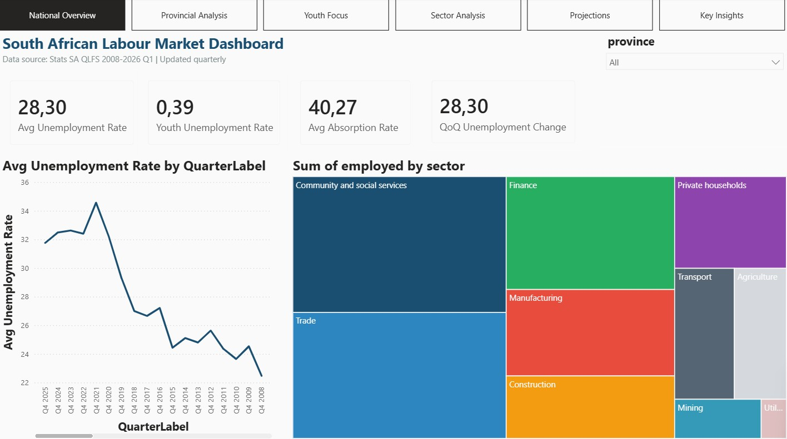
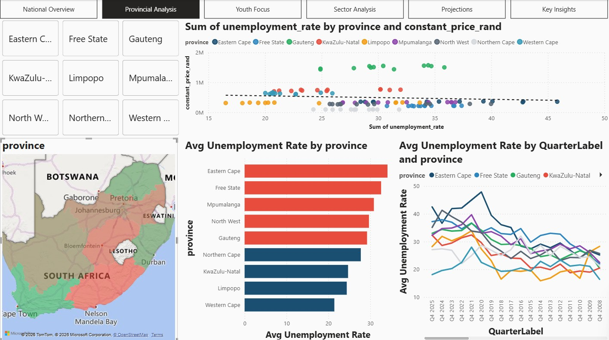
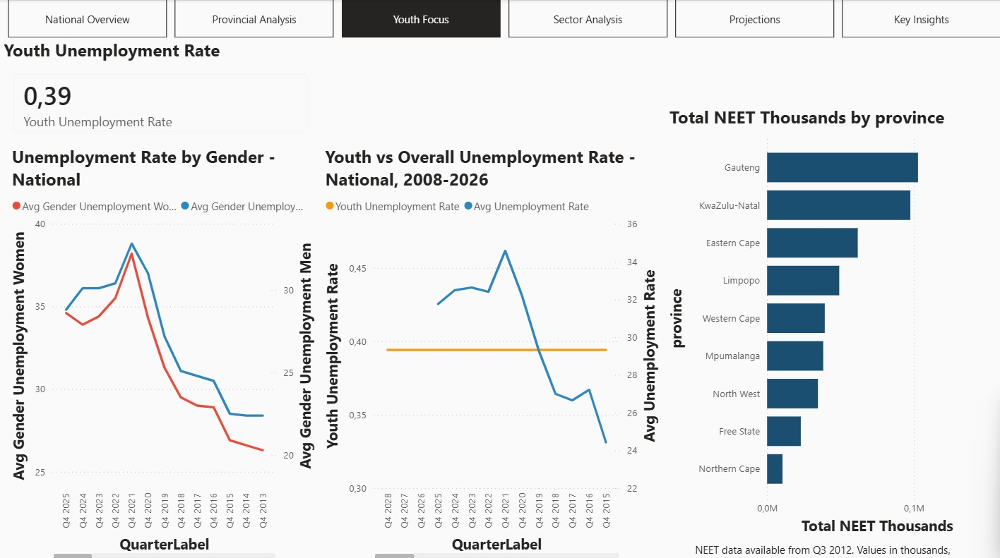
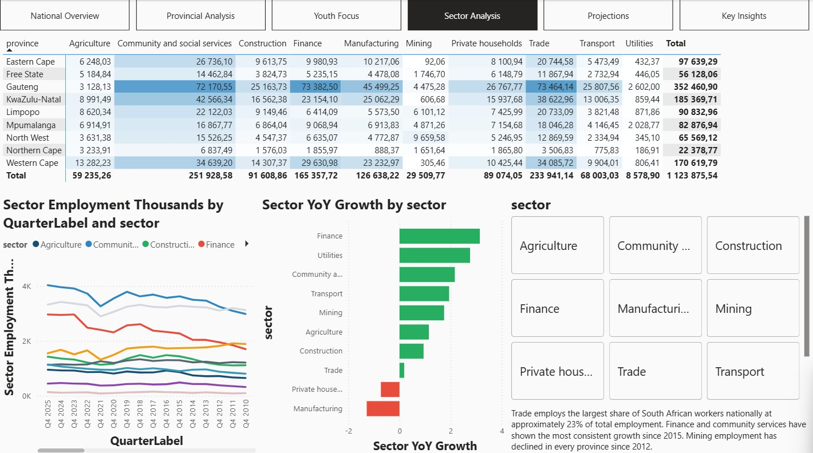
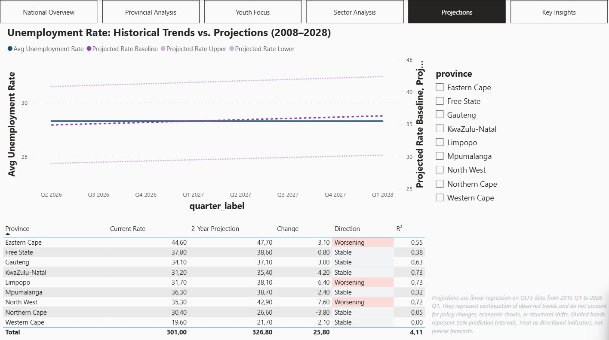
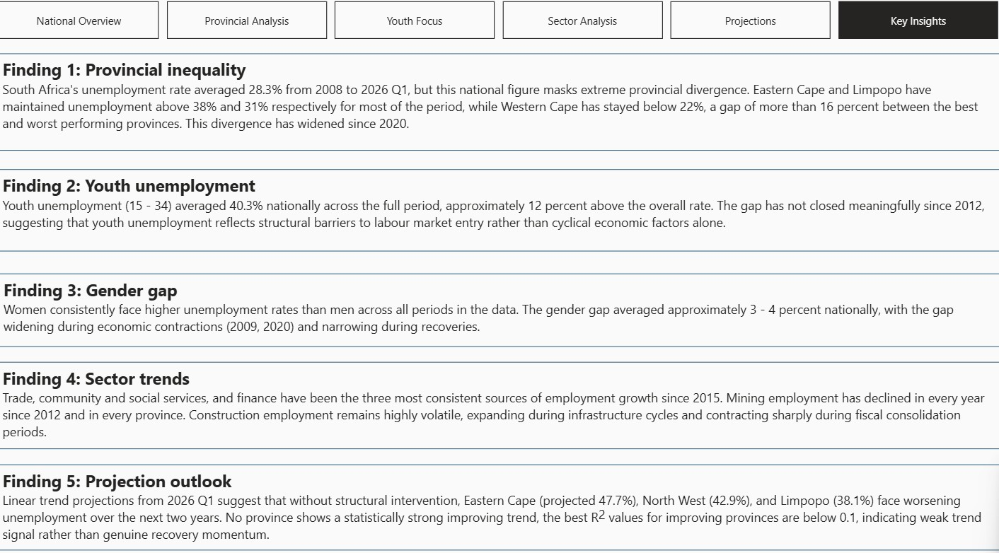

# South African Labour Market Analytics Dashboard

A six-page interactive Power BI dashboard built on real Stats SA Quarterly
Labour Force Survey data (2008–2026 Q1), combining a Python data cleaning
pipeline, DAX time intelligence measures, and linear regression projections
to analyse South African unemployment across provinces, sectors, youth
demographics, and a 2-year forward outlook.

> **To interact with the dashboard:** Download
> `SA_Labour_Market_Analytics_Dashboard.pbix` and open it in
> [Power BI Desktop](https://www.microsoft.com/en-us/power-platform/products/power-bi/desktop)
> (free). No account required.

---

## Dashboard Pages

| Page | What it shows |
|---|---|
| National Overview | 4 KPI cards, unemployment trend line, industry treemap, province slicer |
| Provincial Analysis | Filled map, province ranking bar chart, GDP vs unemployment scatter plot, time series |
| Youth Focus | Youth vs overall trend, gender breakdown line chart, NEET by province |
| Sector Analysis | Sector employment trends, YoY growth ranking, province × sector matrix |
| Projections | 8-quarter linear regression forecast per province with confidence bands, trend summary table |
| Key Insights | 5 written analytical findings drawn directly from the data |

---

## Screenshots

### National Overview


### Provincial Analysis


### Youth Focus


### Sector Analysis


### Projections


### Key Insights


---

## Key Findings

- South Africa's unemployment rate averaged **28.3%** across all provinces
  from 2008 to 2026 Q1, masking a 16 percent gap between
  Western Cape (consistently below 22%) and Eastern Cape and Limpopo
  (consistently above 38%).
- Youth unemployment (15-34) averaged **40.3% nationally**, approximately
  12 percent above the overall rate, with no meaningful closing
  of the gap since 2012, indicating structural barriers rather than
  cyclical economic factors.
- Women face consistently higher unemployment than men (3-4pp gap
  nationally), with the gap widening during economic contractions (2009,
  2020) and narrowing during recoveries.
- Mining employment has declined in every province since 2012. Finance
  and Community & Social Services are the only sectors showing
  consistent employment growth across the full period.
- Linear trend projections from 2026 Q1 suggest Eastern Cape (47.7%),
  North West (42.9%), and Limpopo (38.1%) face worsening unemployment
  over the next two years without structural intervention. No province
  shows a statistically strong improving trend.

---

## Tools

| Aspect | Tools |
|---|---|
| Data source | Stats SA QLFS Trends workbook, Stats SA Provincial GDP Tables |
| Data pipeline | Python 3: pandas, openpyxl, scikit-learn, scipy |
| BI modelling | Power BI Desktop: star schema, DAX measures |
| Time intelligence | PREVIOUSQUARTER, SAMEPERIODLASTYEAR, custom QuarterSort column |
| Projections | Linear regression per province (scikit-learn), 95% confidence intervals |
| Geography | Custom GeoJSON: SA province boundaries (simplemaps.com) |

---

## Data Model

Star schema with 2 dimension tables and 7 fact tables:

```
DimDate ──────────────── fact_labour_status
     │                   fact_industry_employment
     │                   fact_youth_national
     │                   fact_gender_unemployment
     │                   fact_neet_by_province
     │                   fact_national_sector_totals
     │                   fact_projections
     │
DimProvince ──────────── fact_labour_status
                         fact_industry_employment
                         fact_neet_by_province
                         fact_projections
                         fact_trend_summary
```

---

## Repository Structure

```
sa-labour-market-dashboard/
├── README.md
├── clean_data_complete.py              # Full Python cleaning pipeline
├── SA_Labour_Market_Analytics_Dashboard.pbix
├── south_africa_provinces_geojson.json
├── clean_data/
│   ├── fact_labour_status.csv          # 657 rows — province × quarter
│   ├── fact_industry_employment.csv    # 6,570 rows — sector × province × quarter
│   ├── fact_youth_national.csv         # 73 rows — national youth by quarter
│   ├── fact_gender_unemployment.csv    # 146 rows — gender × quarter
│   ├── fact_neet_by_province.csv       # 495 rows — NEET youth by province
│   ├── fact_national_sector_totals.csv # 730 rows — national sector by quarter
│   ├── fact_provincial_gdp.csv         # 108 rows — province × year
│   ├── fact_unemployment_gdp_annual.csv# 108 rows — joined annual dataset
│   ├── fact_projections.csv            # 216 rows — 3 scenarios × 8 quarters × 9 provinces
│   └── fact_trend_summary.csv          # 9 rows — one per province
└── screenshots/
    ├── page1_national_overview.png
    ├── page2_provincial_analysis.png
    ├── page3_youth_focus.png
    ├── page4_sector_analysis.png
    ├── page5_projections.png
    └── page6_key_insights.png
```

---

## Running the Pipeline

**Requirements**

```bash
pip install pandas openpyxl scikit-learn scipy
```

**Data files needed** (download from statssa.gov.za)

- `QLFS Trends 2008-2026Q1.xlsx`
- `Provincial GDP tables 2013 - 2024.xlsx`

Place both files in the same folder as `clean_data_complete.py`, then run:

```bash
python clean_data_complete.py
```

This generates all 10 CSV files in `clean_data/`. Open
`SA_Labour_Market_Analytics_Dashboard.pbix` in Power BI Desktop,
go to **Home → Transform Data**, and update each data source path
to point to your local `clean_data/` folder. Click **Close & Apply**.

---

## Data Sources

| Dataset | Publisher | Period | URL |
|---|---|---|---|
| Quarterly Labour Force Survey Trends | Statistics South Africa | 2008 Q1 – 2026 Q1 | [statssa.gov.za](https://www.statssa.gov.za/?page_id=1854&PPN=P0211&SCH=74511) |
| Gross Domestic Product by Region | Statistics South Africa | 2013–2024 | [statssa.gov.za](https://www.statssa.gov.za/timeseriesdata/Excel/P0441.2%20%20Provincial%20Gross%20Domestic%20Product(2024).zip) |
| SA Province Boundaries | simplemaps.com | Current | Included in repo |

---

## Limitations

- Provincial GDP figures are annual experimental estimates from Stats SA,
  not quarterly actuals. Quarterly unemployment data is averaged to annual
  for the GDP join.
- Youth unemployment breakdown is available at national level only,
  Table 2.2 of the QLFS Trends workbook does not provide provincial
  youth disaggregation.
- Projections use linear trend analysis only and do not account for
  policy interventions, commodity price shocks, or structural economic shifts.
- NEET data is available from Q3 2012 onward only, earlier quarters are
  suppressed in the source data due to small sample sizes.

---

## About This Project

I built this as a portfolio project to demonstrate my end-to-end data analytics
capability, from sourcing and cleaning real government data to building
a professional BI product that tells a coherent analytical story.

The combination of Economics domain knowledge (BCom Economics and
Management Sciences, University of Pretoria) and technical implementation
(Python pipeline, Power BI data modelling, DAX, statistical projection)
reflects the hybrid profile this project was designed to demonstrate.
